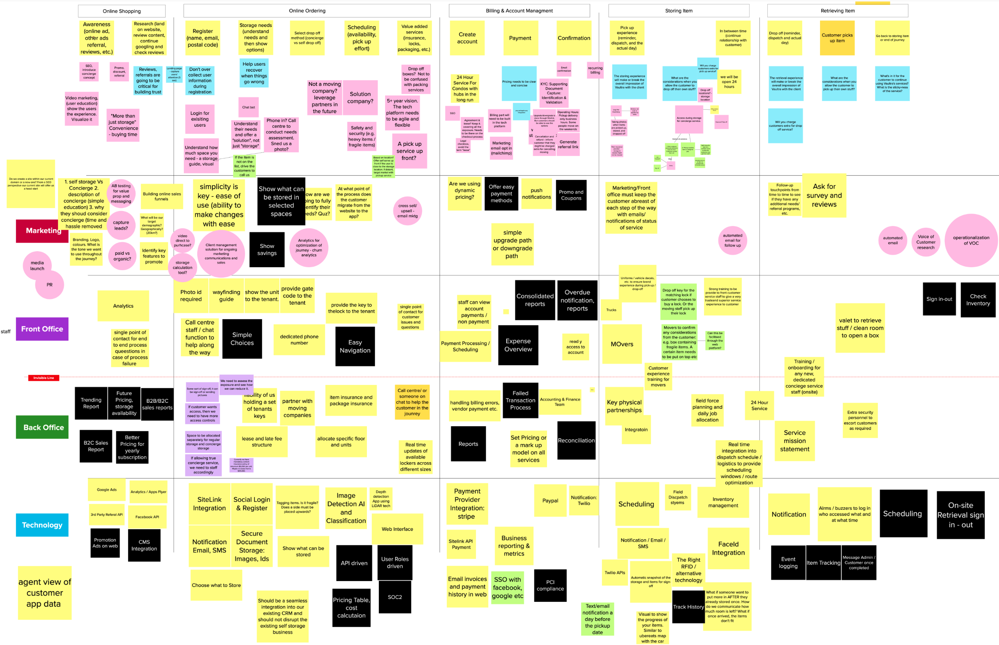
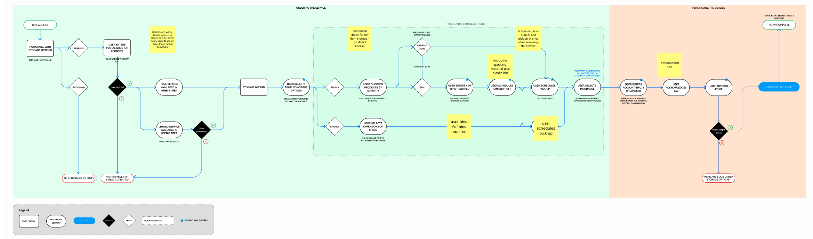
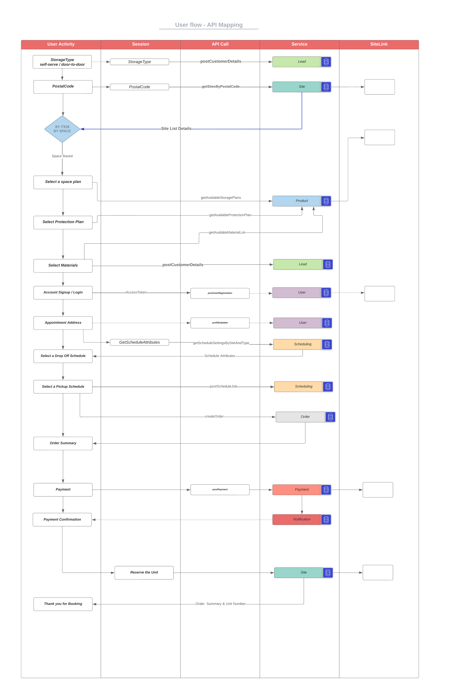
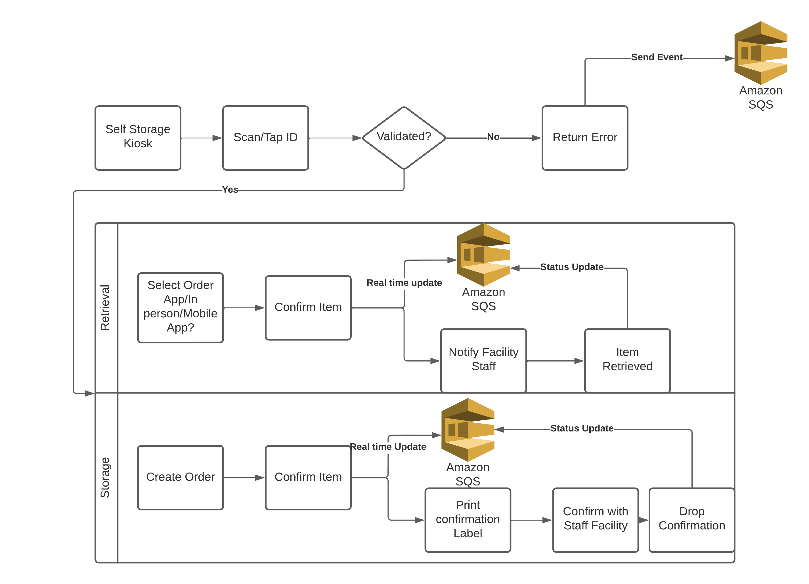
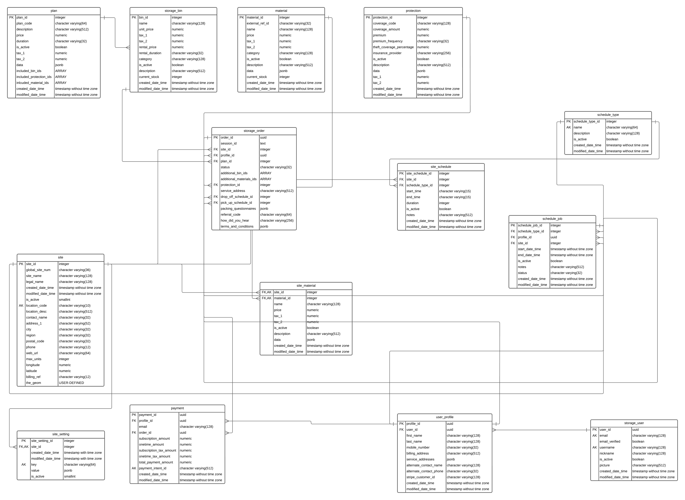
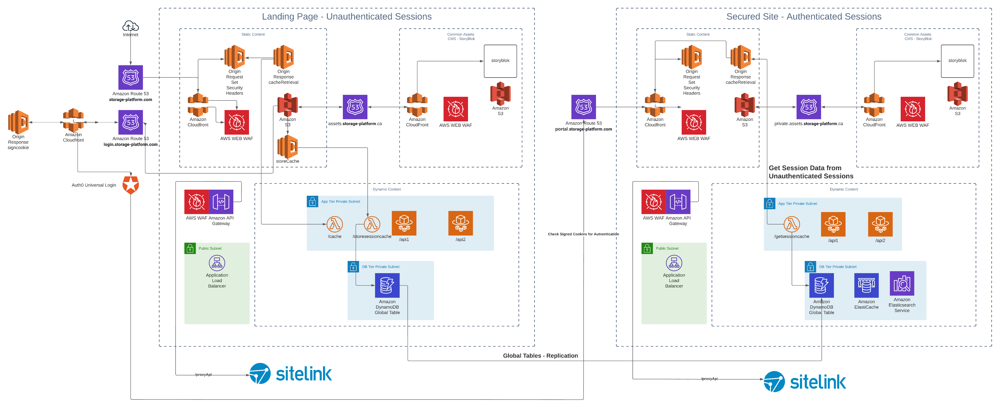
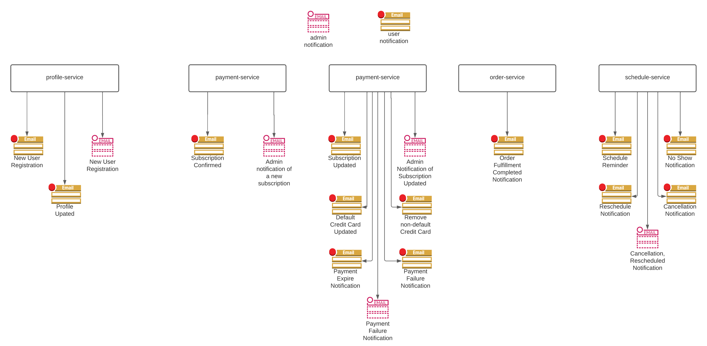
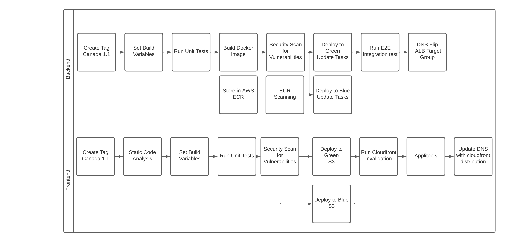
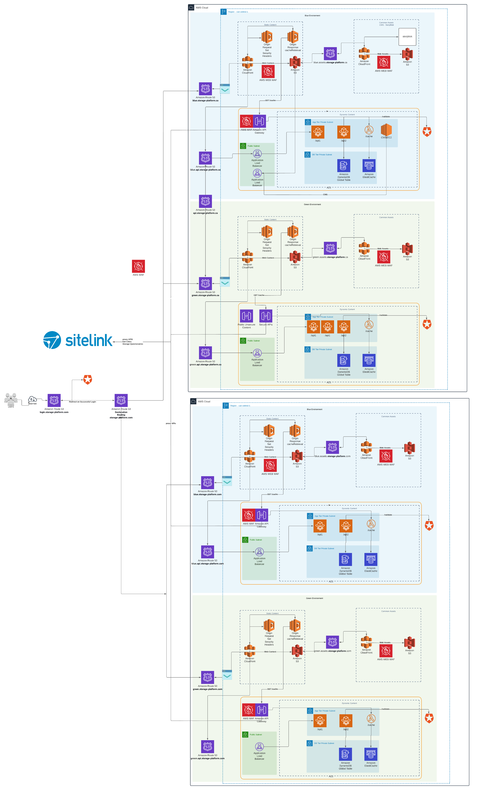

Storage Platform Architecture & Design

### Design Artifacts

- Event Storming

  

- User Flow

  

- User Flow System Mapping

  

- Storage Workflow

  

- Storage Database Schema

  

- Scalable Cloud Architecture
- 
  

- CI/CD Pipeline Design

  

- Notification Scope

  
  
- Blue/Green Deployment Flow

  

- Blue/Green Cloud Architecture

  
